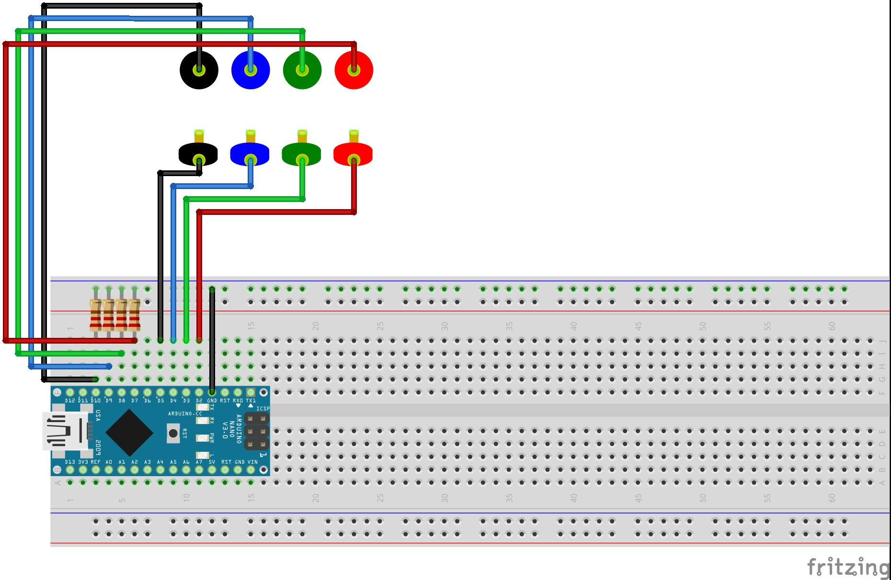
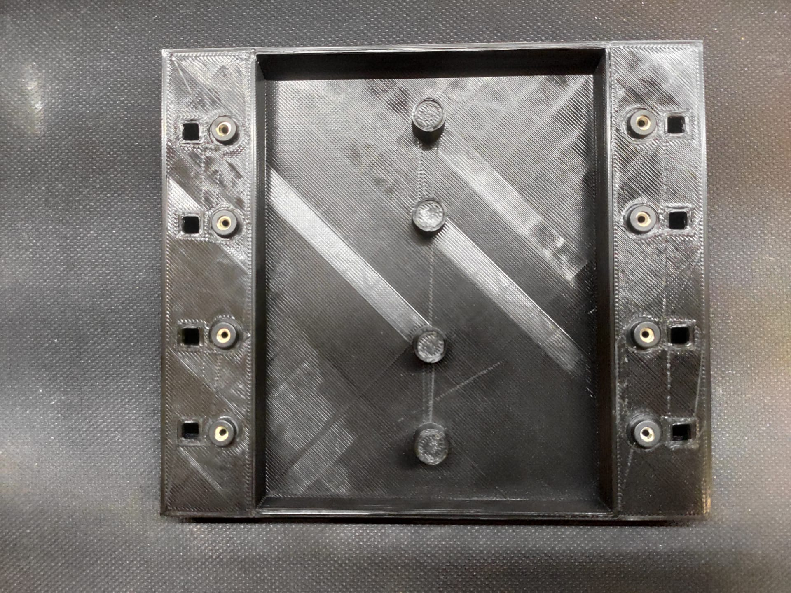

# Telephone Exchange Interaction

The Telephone Exchange Interaction is a mini game that was developed for my Master Thesis "Developing a Support Infrastructure for an Escape The Room and Peddy Paper Games".

This mini game, or interaction as I so call it, was developed to be part of an Escape the Room game that was also developed as part of my thesis. Since this interaction can work as a standalone mini game I decided to place it here for anyone interested in using it.

## List of Components

- [Banana Plug](https://pt.aliexpress.com/item/1005001265835623.html?gatewayAdapt=glo2bra&spm=2114.13010708.0.0.3a99b90alBsLK1) (4x);
- [Banana Socket](https://pt.aliexpress.com/item/1005001265835623.html?gatewayAdapt=glo2bra&spm=2114.13010708.0.0.3a99b90alBsLK1) (4x);
- 220Ω Resistor (2x);
- Arduino Nano (1x);

In order to fully assemble the Interaction, so as to look like the picture below, you will also need to 3D Print the enclosure which is divided into two parts that can be found [here](enclosure/).

## The Purpose of The Game

The Telephone Exchange interaction is a very simple interaction whose purpose is to simply use wires to connect sockets. In this version of the interaction the player must simply connect the sockets using the wires but another version of this interaction makes use of individually addressable RGB LED strips to generate colors on the left side of the left sockets that have a corresponding color on the right side of the sockets on the right and the user must then use the wires to connect these sockets with matching RGB colors on both sides.

## Instructions

First start by uploading the code to your Arduino Nano (This is the one I used so I can only guarantee proper working with this micro-controller).

### Starting the Game

To start the game you must first type in the Arduino IDE serial monitor the following:

- > COM:START;ID:123456789

Once all the wires are correctly connected the following message will appear on the Arduino IDE Serial Monitor:

- > COM:INTERACTION_SOLVED;MSG:User Connected Wires Correctly;PNT:750

## Warning

The source code for this interaction contains a lot of logic that was made to communicate with the infrastructure that was developed for my thesis and therefor it is not as clean as it could be when compared to a mini game that is developed with the intent of being used by the Arduino IDE directly.